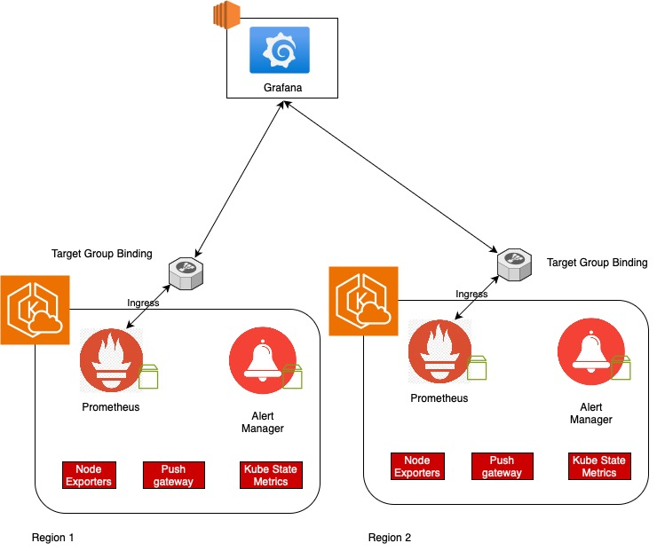

Welcome 👋. I'd like to present an architecture for monitoring distributed EKS clusters. This approach also applys to another Kubernetes cluster types. No vendor lock-in.

## Overview

1. EKS is convinience for provision and run workloads at ease.
2. Monitoring EKS solution providing by AWS is costly and tightly bound to Cloud Watch
3. Providing an opensource monitoring, easy allow to share with dev teams, sales and marketing teams.
<!-- 
[//]: # ([![The template is mobile first with a responsive design to ensure that your site looks stunning on every device.]&#40;https://raw.githubusercontent.com/wowchemy/wowchemy-hugo-modules/main/starters/academic/preview.png&#41;]&#40;https://hugoblox.com&#41;) -->

### Architecture

There are many clusters that have installed Prometheus and Alert Manager. Grafana is used centralized visualization multiple data sources.

